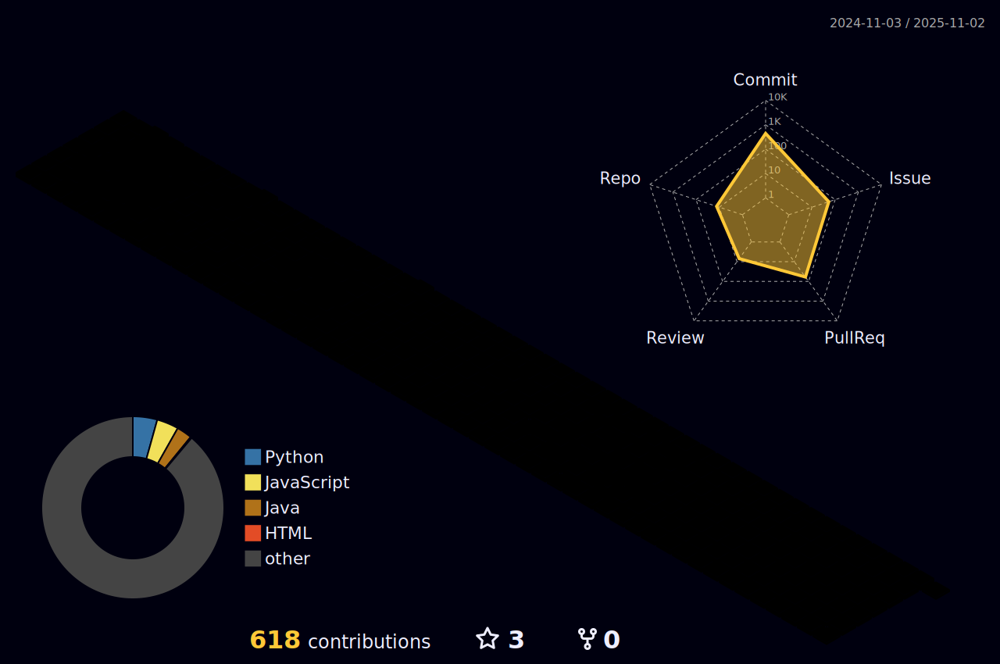

  

    

<!--

-->

<!--[stats](https://github-readme-stats.vercel.app/api?username=juyeon99&theme=blue-green)
    [languages](https://github-readme-stats.vercel.app/api/top-langs/?username=juyeon99&theme=blue-green)
    [github](https://img.shields.io/badge/GitHub-100000?style=for-the-badge&logo=github&logoColor=white)-->
    
<h2 align="center">🚀 Skills that I have used or learned 🚀</h2> 

 

